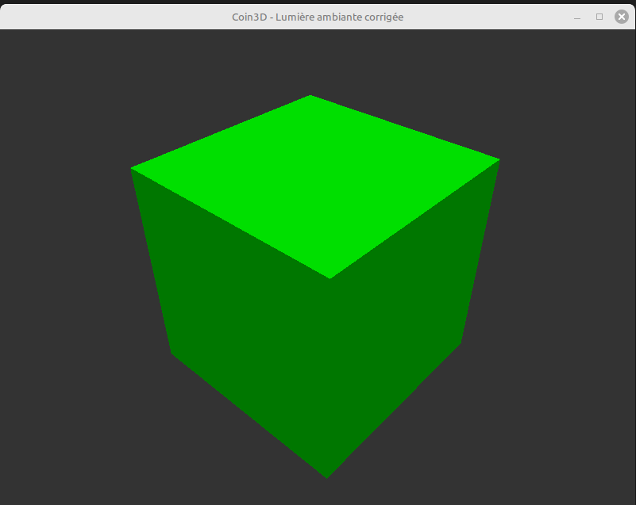
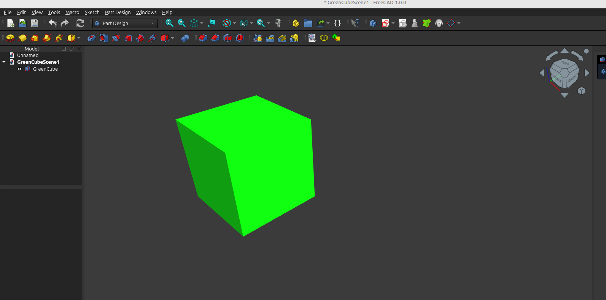

Coin3D is the C++ scenography library of FreeCAD. Pivy is the python wrapper enabling to call Coin3 from python. Here is a kind of helloWorld example to draw a cube.



```python
from PySide6 import QtWidgets, QtOpenGLWidgets, QtCore
from pivy import coin
from OpenGL import GL
import sys
import math


class CoinWidget(QtOpenGLWidgets.QOpenGLWidget):
    def __init__(self, parent=None):
        super().__init__(parent)
        self.scene = None
        self.camera = None
        self.render_area = None

        self.rot_x = 0.0
        self.rot_y = 0.0
        self.distance = 5.0

        self.last_mouse_pos = None

        self.setFocusPolicy(QtCore.Qt.StrongFocus)

    def build_scene(self):
        root = coin.SoSeparator()

        # Camera
        self.camera = coin.SoPerspectiveCamera()
        root.addChild(self.camera)

        # Directionnal Light
        light = coin.SoDirectionalLight()
        light.direction = coin.SbVec3f(-0.5, -1.0, -0.5)
        light.color = coin.SbColor(1, 1, 1)
        root.addChild(light)

        # green Material
        mat = coin.SoMaterial()
        mat.diffuseColor.setValue(0.0, 1.0, 0.0)
        mat.ambientColor.setValue(0.0, 0.3, 0.0)
        mat.specularColor.setValue(0.5, 0.5, 0.5)
        mat.shininess.setValue(0.2)
        root.addChild(mat)

        # the cube
        cube = coin.SoCube()
        root.addChild(cube)

        return root

    def initializeGL(self):
        GL.glClearColor(0.2, 0.2, 0.2, 1.0)  # Background dark grey
        GL.glEnable(GL.GL_DEPTH_TEST)        # depth Test activation

        viewport = coin.SbViewportRegion(self.width(), self.height())
        self.render_area = coin.SoGLRenderAction(viewport)
        self.scene = self.build_scene()
        self.update_camera()

    def resizeGL(self, w, h):
        if self.render_area and self.camera:
            vp = coin.SbViewportRegion(w, h)
            self.render_area.setViewportRegion(vp)
            self.camera.aspectRatio = w / h
            self.update_camera()

    def paintGL(self):
        if self.render_area and self.scene:
            GL.glClear(GL.GL_COLOR_BUFFER_BIT | GL.GL_DEPTH_BUFFER_BIT)
            self.render_area.apply(self.scene)

    def update_camera(self):
        x = self.distance * math.sin(self.rot_y) * math.cos(self.rot_x)
        y = self.distance * math.sin(self.rot_x)
        z = self.distance * math.cos(self.rot_y) * math.cos(self.rot_x)

        self.camera.position.setValue(coin.SbVec3f(x, y, z))
        self.camera.pointAt(coin.SbVec3f(0, 0, 0), coin.SbVec3f(0, 1, 0))

    def mousePressEvent(self, event):
        if event.buttons() & QtCore.Qt.LeftButton:
            self.last_mouse_pos = event.position()

    def mouseMoveEvent(self, event):
        if self.last_mouse_pos is not None:
            dx = event.position().x() - self.last_mouse_pos.x()
            dy = event.position().y() - self.last_mouse_pos.y()

            self.rot_y += dx * 0.005
            self.rot_x += dy * 0.005

            self.rot_x = max(-math.pi/2 + 0.01, min(math.pi/2 - 0.01, self.rot_x))

            self.update_camera()
            self.update()

            self.last_mouse_pos = event.position()

    def mouseReleaseEvent(self, event):
        self.last_mouse_pos = None

    def wheelEvent(self, event):
        delta = event.angleDelta().y() / 120
        self.distance *= (0.9 ** delta)
        self.distance = max(1.0, min(20.0, self.distance))

        self.update_camera()
        self.update()

    def keyPressEvent(self, event):
        if event.key() == QtCore.Qt.Key_R:
            self.rot_x = 0
            self.rot_y = 0
            self.distance = 5.0
            self.update_camera()
            self.update()
        else:
            super().keyPressEvent(event)


class MainWindow(QtWidgets.QMainWindow):
    def __init__(self):
        super().__init__()
        self.viewer = CoinWidget()
        self.setCentralWidget(self.viewer)
        self.setWindowTitle("Coin3D - Lumière ambiante corrigée")


def main():
    app = QtWidgets.QApplication(sys.argv)
    win = MainWindow()
    win.resize(800, 600)
    win.show()
    sys.exit(app.exec())


if __name__ == "__main__":
    main()

```

## Equivalent Code in a FreeCAD Macro



``` python
import FreeCAD as App
import FreeCADGui as Gui
import Part
import Draft

doc = App.newDocument("GreenCubeScene")

# Créer un cube
cube = doc.addObject("Part::Box", "GreenCube")
cube.Length = 10
cube.Width = 10
cube.Height = 10
cube.Placement.Base = App.Vector(-5, -5, -5)

# Appliquer une couleur verte au cube
view_object = cube.ViewObject
view_object.ShapeColor = (0.0, 1.0, 0.0)   # Vert pur
view_object.DiffuseColor = [(0.0, 1.0, 0.0)] * len(cube.Shape.Faces)
#view_object.SpecularColor = (0.5, 0.5, 0.5)
view_object.Transparency = 0
view_object.DisplayMode = "Shaded"

# Forcer le recalcul
doc.recompute()

# Positionner la vue caméra
Gui.ActiveDocument.ActiveView.viewAxonometric()
Gui.ActiveDocument.ActiveView.setCameraType("Perspective")

# Ajouter une lumière directionnelle
# NB : FreeCAD utilise la lumière OpenGL mais ce n’est pas accessible par script en détail.
# On peut simuler une lumière avec une source dans la vue 3D
try:
    from pivy import coin

    sg = Gui.ActiveDocument.ActiveView.getSceneGraph()

    light = coin.SoDirectionalLight()
    light.direction.setValue(-0.5, -1.0, -0.5)
    light.color.setValue(1, 1, 1)

    sg.insertChild(light, 1)  # Ajoute après la caméra

except ImportError:
    App.Console.PrintWarning("pivy non disponible, lumière directionnelle non ajoutée.\n")

# Centrer la vue
Gui.SendMsgToActiveView("ViewFit")

```
