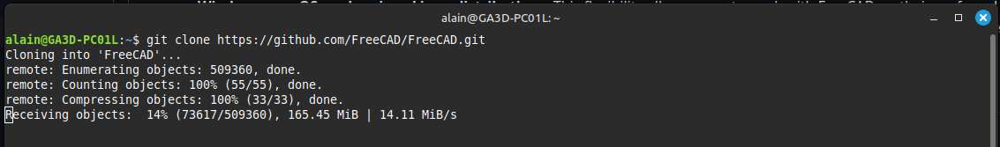
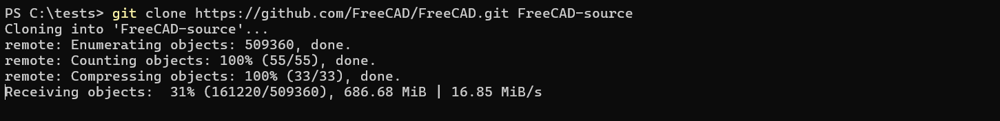
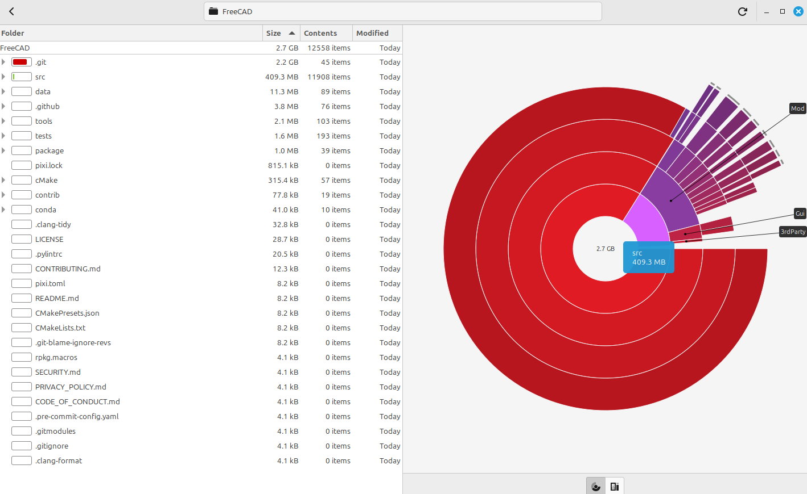
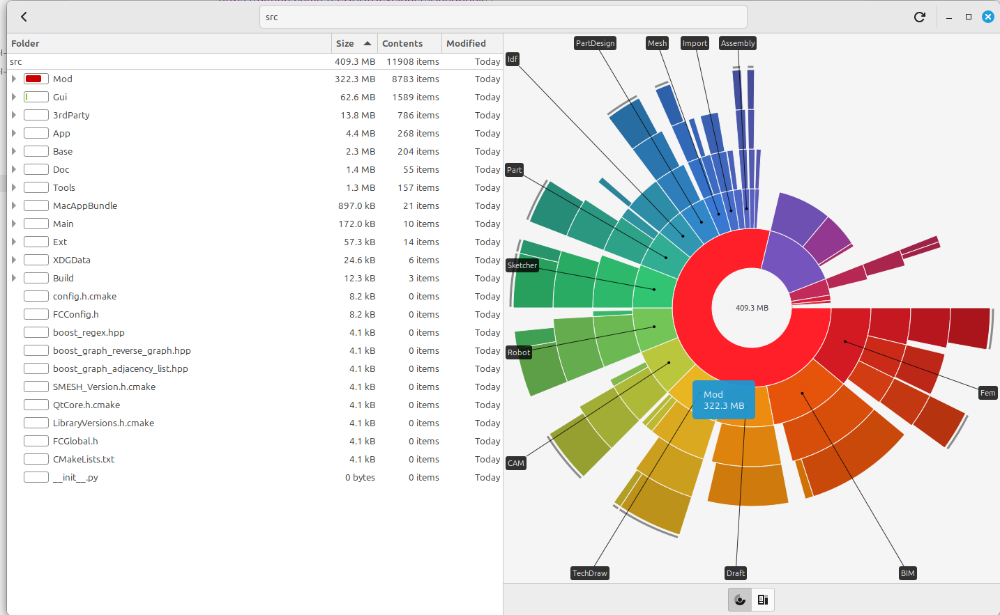
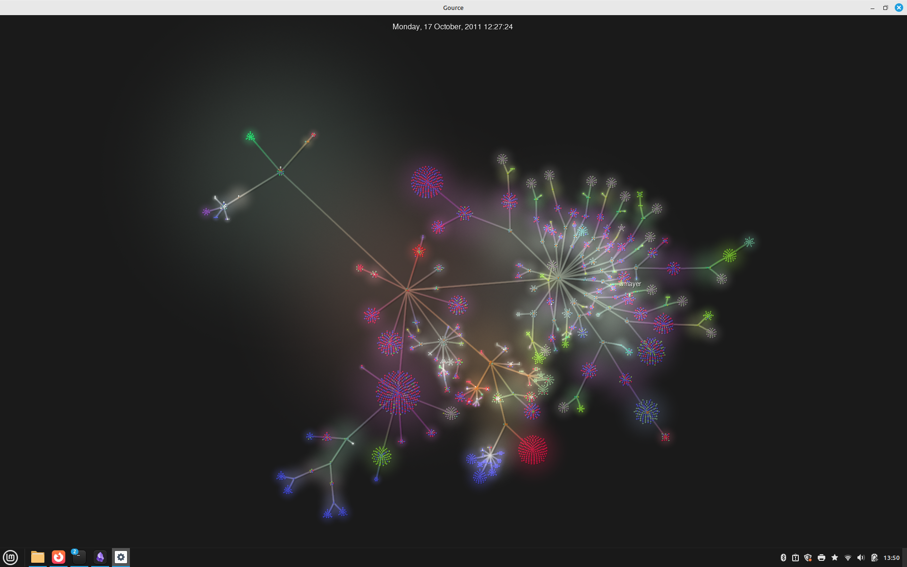

## What is FreeCAD ? (as a software technology)

FreeCAD is:

- A **parametric 3D CAD modeler**.

- Written mostly in **C++** for performance.

- Extensible in **Python** for scripting and rapid development.

- Built using **Qt** (GUI), **Coin3D/OpenInventor** (3D rendering), **OpenCASCADE** (geometry/kernel), **PySide** (Python-Qt bindings).

- FreeCAD is a **cross-platform software**, meaning its use isn't limited to just one operating system. You can run it seamlessly on **Windows, macOS, and various Linux distributions.** 


## Unlocking Possibilities: FreeCAD's Free and Open-Source Nature

FreeCAD is free and open-source software (FOSS), meaning it comes with freedoms for users: to run it for any purpose, to study how it works and change it, to redistribute copies, and to distribute modified versions. This is ensured by its license, the LGPL-2.0-or-later. This implies no licensing fees, the ability to use it commercially without restrictions, and the possibility for anyone to contribute to its development. The source code is openly available, fostering community collaboration and transparency.

 FreeCAD is a **cross-platform software**, meaning its use isn't limited to just one operating system. You can run it seamlessly on **Windows, macOS, and various Linux distributions.** This flexibility allows users to work with FreeCAD on their preferred system without any restrictions or the need to switch operating environments. It ensures accessibility and broadens its user base across different platforms.

## Official source code repository
[https://github.com/FreeCAD/FreeCAD](https://github.com/FreeCAD/FreeCAD)

## Official website
[https://www.freecad.org/](https://www.freecad.org/)

## Usefull Developpers Ressources

the latest and most up-to-date grouping to help new developers

[https://freecad.github.io/DevelopersHandbook/](https://freecad.github.io/DevelopersHandbook/)
[https://github.com/FreeCAD/DevelopersHandbook](https://github.com/FreeCAD/DevelopersHandbook)

the most technical stuff :
[https://freecad.github.io/DevelopersHandbook/technical/](https://freecad.github.io/DevelopersHandbook/technical/)
## Where to Start as a Contributor ?

Let's start by downloading the source code on our own machine.

### Linux
```
$ git clone https://github.com/FreeCAD/FreeCAD.git
cd FreeCAD
```


### Windows
```
git clone https://github.com/FreeCAD/FreeCAD.git FreeCAD-source
```



To do this, install git for windows if you haven't already done so
[https://git-scm.com/downloads/win](https://git-scm.com/downloads/win)


## 1st Exploration

on May 16, 2025, the complete repository is about 2.7 Gb.

Version management takes up most of the folder's volume, followed by src, which is mainly made up of mods that correspond to workbenches.





visualization of deposit evolution with gource


